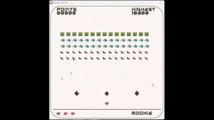

# Garden Maniac

A 2D Shooting Game developed in C++ using raylib videogame library.



## Table of Contents
- [Overview](#overview)
- [Features](#features)
- [Installation](#installation)
- [How to Play](#how-to-play)
- [Built With](#built-with)
- [License](#license)

## Overview
This is a simple 2D arcade shooter game where the player controls a mushroom shooter to defeat waves of enemies. The game features intuitive controls, enemy AI, and simple obstacles. It’s designed to be lightweight, and it demonstrates the basics of game development using Raylib and C++.

## Features
  - Levels: Game stays on fixed "Rookie" level as it progresses.
  - Different Enemy Types: Various enemy behaviors keep players engaged.
  - Obstacles: The diamond shaped obstacled can be destroyed on bullet collision serving a two-way purpose: saving player health by dodging enemy bullets, and vice versa from enemy POV.
  - High Score Tracking: Records the player’s highest score.
  - Audio: Gameplay background music loaded from assets.
  - Smooth Controls: Optimized arrow keys and spacebar for a responsive gaming experience.

## Installation
To get a local copy up and running, follow these simple steps.

###### Prerequisites:
Make sure you have the following installed:
  - C++ Compiler (like GCC or Clang)
  - Raylib library (version 3.0 or later)
    
1. Clone the repository:
   
  ```bash
  git clone https://github.com/pushpitasaha/garden-maniac.git
  cd garden-maniac
  ```
2. Install Raylib: Follow the installation guide on the Raylib website. (https://www.raylib.com)

3. Compile the Game:

  ```bash
    g++ -o garden-maniac main.cpp -lraylib -std=c++17
  ```
4. Running the Game
After compiling, you can run the game by executing:

```bash
./garden-maniac
```

## How to Play
  - Movement: Use the arrow keys (RIGHT or LEFT) to move.
  - Shoot: Press the spacebar to shoot.
  - Goal: Survive as long as possible while defeating waves of enemies.
  - Obstacles: Hideout to dodge bullets.

## Built With
- **Raylib** - A simple and easy-to-use library to enjoy videogame programming
- **C++** - The core programming language used for the game logic

## License 
Distributed under the MIT License. See LICENSE for more information.
